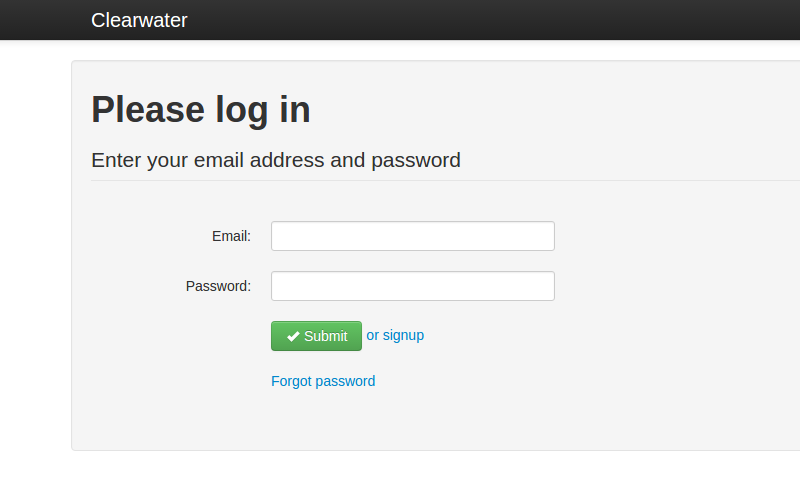
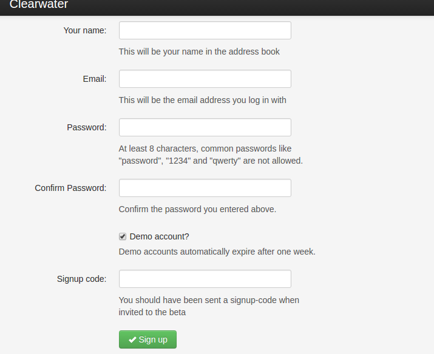

# Clearwater

## Introduction

Clearwater is a vIMS solution in the Cloud. [See](http://www.projectclearwater.org/about-clearwater/) more about this solution!

[Clearwater architecture](http://www.projectclearwater.org/technical/clearwater-architecture/) is designed for deployment on cloud environments. It sourced on the best practice IT software architecture (Load-balancing state-less, easy clustering etc...).


## Clearwater vIMS deployment on OpenStack Mitaka

To deploy the Clearwater vIMS, you must have previously installed the **Cloudify** orchestrator on OpenStack (see [this doc](cloudify.md)).


### Upload Clearwater blueprint

Log into `cloudify-cli` (the host where you installed the Cloudify CLI) and enter in the virtual environment with source command.

1. Download blueprint using git <br>

   ```shell
   cd ~/cloudify/cloudify-manager/
   mkdir blueprints && cd blueprints
   git clone -b 3.4-build https://github.com/Orange-OpenSource/opnfv-cloudify-clearwater.git
   ```
1. Upload blueprint on the Cloudify orchestrator <br>

   ```shell
   cd opnfv-cloudify-clearwater
   cfy blueprints upload -b clearwater -p openstack-blueprint.yaml
   ```


### Create and launch deployment

**Warning !**: For the moment, Cloudify doesn't support input parameters to specify the number of node instance to deploy. See the [post](https://groups.google.com/forum/#!topic/cloudify-users/wGbr9kco0qM) on cloudify forum!

By default, 2 sprout node and 1 node of each other type will be deployed. If you want change it, you can modify `default_instances: 2` of `sprout_host` in the file `openstack-blueprint.yaml` on blueprint definition or scale your deployment after launch.

1. To create and launch the deployment you will have to pass the parameters of your Openstack environment. For that, must be specified the deployment **inputs parameters**. A **template** file already exists. You can copy it and complete it to fit with your OpenStack cloud platform <br>

   ```
   cp inputs/openstack.yaml.template inputs/inputs.yaml
   vim inputs/inputs.yaml
   ```
   Bellow is an example of `input.yaml` file configurations for my Openstack Mitaka platform <br>

   ```
   image_id: '421bb8af-b8ba-46d9-a6f6-2ae4b826fe4c'  # OS image ID (Ubuntu 14.04)
   flavor_id: '2'                                    # Flavor ID (~ 2 Go RAM)
   agent_user: 'ubuntu'                              # By default is ubuntu for ubuntu image
   external_network_name: 'ext-net'                  # external network on Openstack
   public_domain: 'clearwater.pub'                   # SIP domain name
   ```
   You can also pass the parameters from the Cloud Manager Server GUI—Create Deployment using Blueprints.
1. Once the input file is completed, you must create the deployment on orchestrator <br>

   ```
   cfy deployments create -b clearwater -d clearwater-test --inputs inputs/inputs.yaml
   ```
1. Launch Clearwater deployment

   ```
   cfy executions start -w install -d clearwater-test --timeout=3600
   ```
   If this result appears on console, installaton of your Clearwater is finished

   ```
   2017-02-23T02:55:29 CFY <clearwater-test> 'install' workflow execution succeeded
   Finished executing workflow install on deployment clearwater-test
   * Run 'cfy events list --include-logs --execution-id 0cee8d5c-179c-4239-8759-0b025a922c3f'
   to retrieve the execution's events/logs
   ```

**Note:** During the deployment, please confirm if the ‘default security’ of the OpenStack is added on VM instances. Pass all UDP, TCP and ICMP traffic during Clearwater installation. The default security group can be deleted from all instances once the application is installed successfully.

Once the deployment is successfully finished, you can create new numbers on the Ellis website



and then register a sip phone (softphone). You can help you with the [clearwater documentation](https://clearwater.readthedocs.org/en/latest/Making_your_first_call/index.html). In the ellis sign-up page, by default the signup-code is **secret**.



But to register your softphone, you must use dns of the deployment with its public IP. Or declare the Bonos public IP on your own DNS server.


## Test

### [Clearwater Live Tests](https://clearwater.readthedocs.io/en/latest/Running_the_live_tests.html)

The following live tests can be run over a Clearwater deployment to confirm that the high level function is working for the vIMS.

1. On the developer node (e.g. the `cloudify-cli` host where you installed the Cloudify CLI), install Ruby version 1.9.3 and its dependencies <br>

   ```shell
   sudo apt-get install build-essential git --yes
   curl -L https://get.rvm.io | bash -s stable
   source ~/.rvm/scripts/rvm
   rvm autolibs enable
   rvm install 1.9.3
   rvm use 1.9.3
   ```
1. Run the following to download and install the Clearwater test suite <br>

   ```shell
   git clone -b stable --recursive git@github.com:Metaswitch/clearwater-live-test.git
   cd clearwater-live-test
   bundle install
   ```
   Make sure that you have an SSH key - if not, see the [GitHub instructions](https://help.github.com/articles/generating-ssh-keys) for how to create one.
1. To run the subset of the tests that don’t require PSTN interconnect to be configured, simply run <br>

   ```shell
   rake test[<domain>] SIGNUP_CODE=<code> PROXY=<Bono domain> ELLIS=<Ellis domain>
   rake test[default] SIGNUP_CODE=secret PROXY=192.168.37.141 ELLIS=192.168.37.140
   ```
   where domain: default, code: secret, PROXY: 192.168.37.141, ELLIS: 192.168.37.140
1. The results will be printed on-screen <br>

   ```
   Basic Call - Mainline (TCP) - (6505550190, 6505550546) Passed
   Basic Call - SDP (TCP) - (6505550294, 6505550068) Passed
   Basic Call - Tel URIs (TCP) - (6505550335, 6505550756) Passed
   Basic Call - Unknown number (TCP) - (6505550596, 6505550179) Passed
   Basic Call - Rejected by remote endpoint (TCP) - (6505550258, 6505550210) Passed
   Basic Call - Messages - Pager model (TCP) - (6505550023, 6505550894) Passed
   Basic Call - Pracks (TCP) - (6505550248, 6505550993) Passed
   Basic Registration (TCP) - (6505550269) Passed
   Multiple Identities (TCP) - (6505550261, 6505550347) Passed
   Call Barring - Outbound Rejection (TCP) - (6505550007, 6505550410) Passed
   Call Barring - Allow non-international call (TCP) - Skipped (No PSTN support)
      - Call with PSTN=true to run test
   ...
   ...
   ...
   SUBSCRIBE - reg-event (TCP) - (6505550685) Passed
   SUBSCRIBE - reg-event with a GRUU (TCP) - (6505550845) Passed
   SUBSCRIBE - Subscription timeout (TCP) - (6505550257) Passed
   SUBSCRIBE - Registration timeout (TCP) - (6505550912, 6505550033) Passed
   0 failures out of 88 tests run
   39 tests skipped
   ```


### Use OPNFV/Functest container

It's the same test but the installation of all dependencies was already done in this container. In addition, this test provide a `json` file of all test result.

You can run Functest container in your Cloudify CLI VM. To do that, you must install docker into this VM

```
curl -sSL https://get.docker.com/ | sh
```

After that, you can download OPNFV/Functest container image

```
docker pull opnfv/functest
```

Then you can run the container

```
docker run --dns=<BIND_PUBLIC_IP> -it opnfv/functest /bin/bash
```

Next you can launch the signaling testing of your deployment

```
cd ~/repos/vims-test
source /etc/profile.d/rvm.sh
rake test[<YOUR_PUBLIC_DOMAIN_NAME>] SIGNUP_CODE=secret
```


## Scaling

### Manually

With [built-in workflow](http://getcloudify.org/guide/3.2/workflows-built-in.html) on Cloudify you can manually **scale** your Clearwater deployment.

Before **scale** your deployment, create the input file

```
vim scale.yaml
```

with the following parameters

```
node_id: sprout
delta: 1
scale_compute: true
```

These parameters will create one Sprout VM and add it on Sprout cluster.

Then launch **scale** with this command

```
cfy executions start -w scale -d clearwater-test -p scale.yaml
```

**Warning !** : For the moment, the Bono scale doesn't work correctly because Cloudify don't support "one_to_one" relationships. See the [post](https://groups.google.com/d/msg/cloudify-users/TPqoGZYHEYs/tSrfptDUyKwJ) on Cloudify forum!


### Auto-Scale

```
 groups:
  clearwater_hosts:
    members: [sprout_host]
    policies:
      mem_scale_policy:
        type: cloudify.policies.types.threshold
        properties:
          service: cpu.total.user
          threshold: 85
        triggers:
          scale_trigger:
            type: cloudify.policies.triggers.execute_workflow
            parameters:
              workflow: scale
              workflow_parameters:
                node_id: sprout
                delta: 1
```


## Uninstall Clearwater vIMS

1. Log into `cloudify-cli` (the host where you installed the Cloudify CLI) and enter in the virtual environment with source command <br>

   ```shell
   source  cloudify/bin/activate
   ```
1. To uninstall properly Clearwater deployment, execute this command <br>

   ```shell
   cfy executions start -w uninstall -d clearwater-test
   ```


## Reference

1. [Installation Runbook for vIMS (Project Clearwater)](https://950b04d5967e797d455c-4b2d2a5b1eb18dc3d5e79a7b856f687e.ssl.cf5.rackcdn.com/application%20validation/vIMS_Clearwater_runbook_v1.0.pdf)
1. [opnfv cloudify clearwater](https://github.com/Orange-OpenSource/opnfv-cloudify-clearwater/blob/master/docs/clearwater.md)
1. [Clearwater IMS All-in-one环境搭建指导书](http://xunknown.lofter.com/post/2734f8_568f48b)
